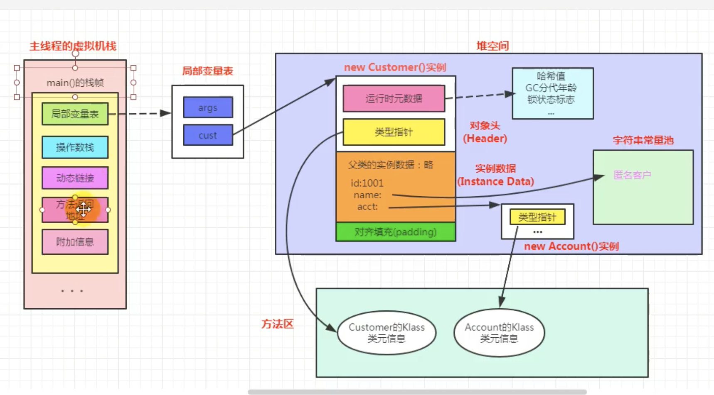
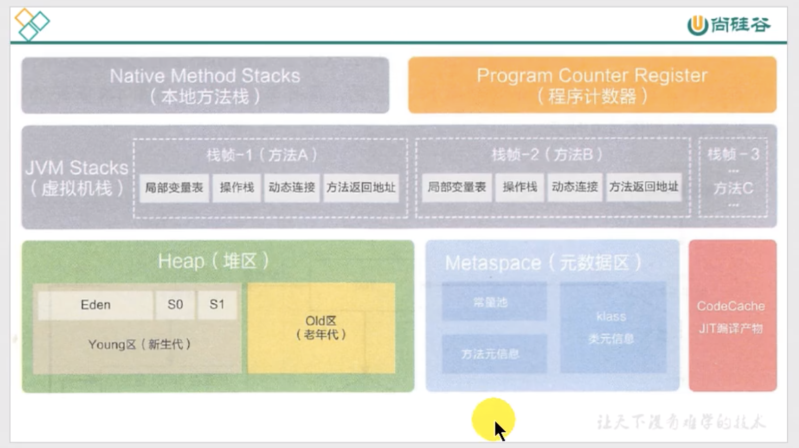
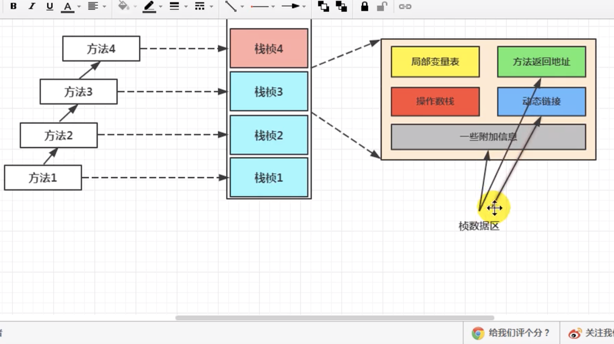
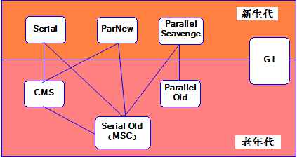
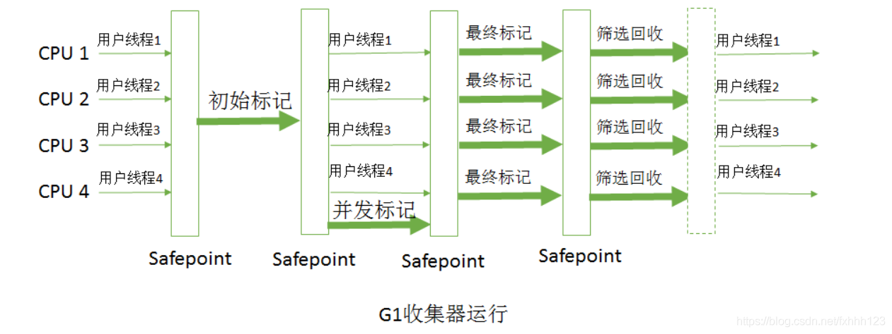
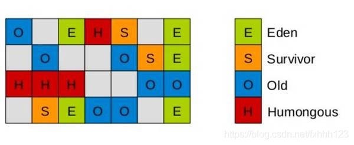
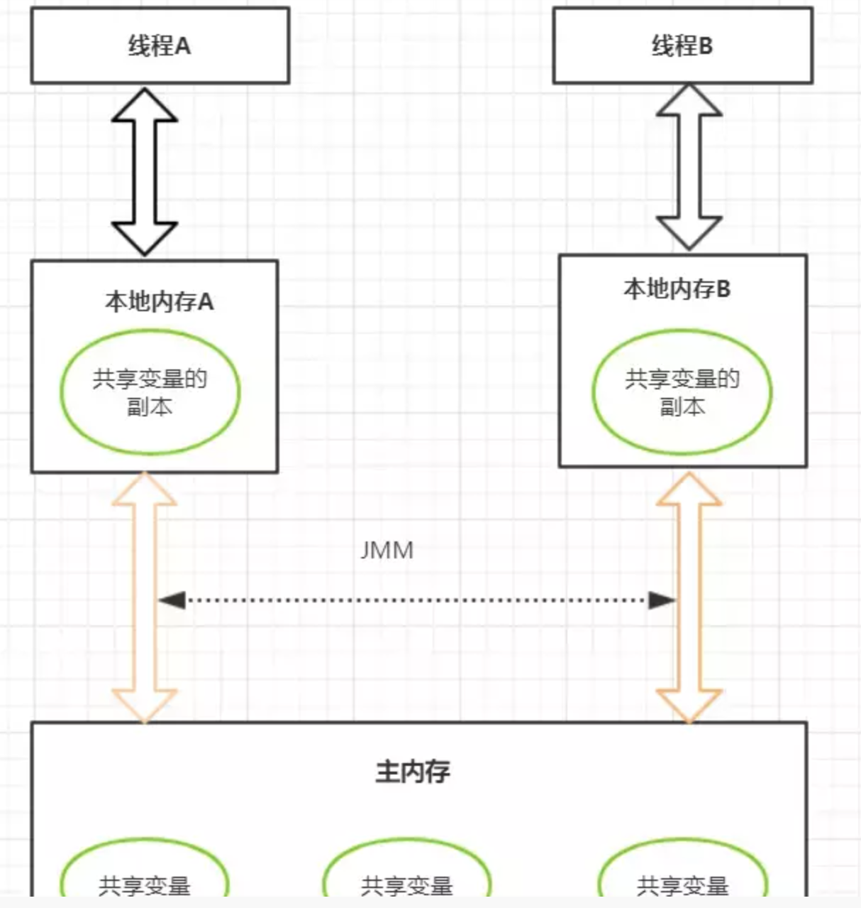
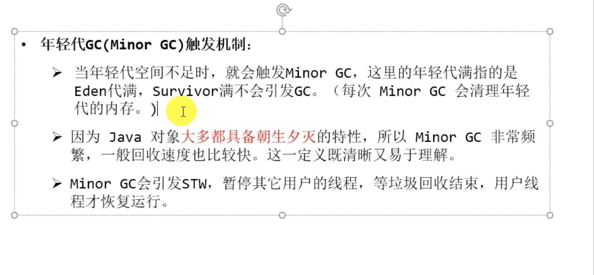
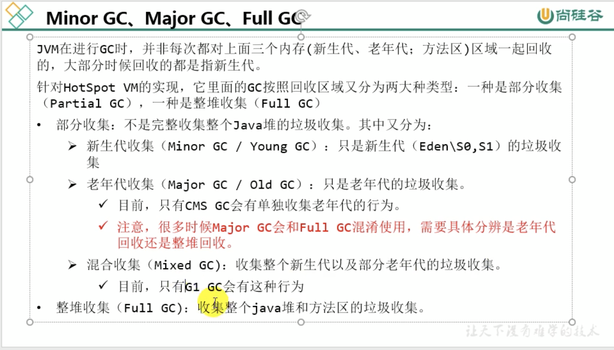
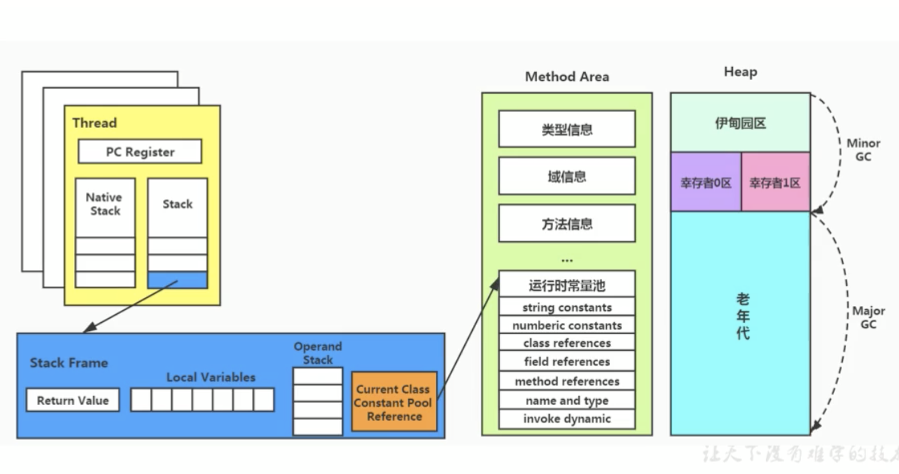

# Java创建一个对象时虚拟机的内存分配 

# 类加载

# 简单说说你了解的类加载器，可以打破双亲委派么，怎么打破。
## 1) 什么是类加载器？分别是哪几类？
### 类加载器 就是根据指定全限定名称将.class文件加载到JVM内存，并对数据进行校验，解析和初始化，最终形成可以被虚拟机直接使用的java类型。
	1、启动类加载器（Bootstrap ClassLoader）
	2、扩展类加载器（Extension ClassLoader）
	3、系统类加载器（System ClassLoader）
		负责加载用户类路径（classpath）上的指定类库，我们可以直接使用这个类加载器。一般情况，如果我们没有自定义类加载器默认就是用这个加载器。
	4、用户自定义类加载器

#
# 双亲委派模型
### 双亲委派模型工作过程是：如果一个类加载器收到类加载的请求，它首先不会自己去尝试加载这个类，而是把这个请求委派给父类加载器完成。每个类加载器都是如此，只有当父加载器在自己的搜索范围内找不到指定的类时（即ClassNotFoundException），子加载器才会尝试自己去加载。
#
# 为什么需要双亲委派模型？
	如果没有双亲委派，那么用户是不是可以自己定义一个java.lang.Object的同名类，java.lang.String的同名类，并把它放到ClassPath中,那么类之间的比较结果及类的唯一性将无法保证，因此，为什么需要双亲委派模型？防止内存中出现多份同样的字节码
## 怎么打破双亲委派模型？
	打破双亲委派机制则不仅要继承ClassLoader类，还要重写loadClass和findClass方法。

# ClassLoader的重要方法
	Class loadClass(String name) ：name参数指定类装载器需要装载类的名字，必须使用全限定类名。
	Class defineClass(String name,byte[] b,int len)：将类文件的字节数组转换成JVM内部的java.lang.Class对象。字节数组可以从本地文件系统、远程网络获取。参数name为字节数组对应的全限定类名。
	Class findSystemClass(String name)：从本地文件系统在来Class文件。如果本地系统不存在该Class文件。则抛出ClassNotFoundException异常。该方法是JVM默认使用的装载机制
	Class findLoadedClass(String name)：调用该方法来查看ClassLoader是否已载入某个类。如果已载入，那么返回java.lang.Class对象；否则返回null。如果强行装载某个已存在的类，那么则抛出链接错误。
	ClassLoader getParent()：获取类装载器的父装载器。除根装载器外，所有的类装载器都有且仅有一个父装载
	器。
	ExtClassLoader的父装载器是根装载器，因为根装载器非java语言编写，所以无法获取，将返回null。

#
# 详解JVM内存结构	
## 程序计数器：
---
### &emsp;&emsp;当前线程所执行的字节码的行号指示器，用于记录正在执行的虚拟机字节指令地址，线程私有。该内存区域是唯一一个java虚拟机规范没有规定任何OOM情况的区域。
---
## Java虚拟栈：
---
### &emsp;&emsp;1. 虚拟机栈也就是我们平常所称的栈内存,它为java方法服务，每个方法在执行的时候都会创建一个栈帧，用于存储局部变量表、操作数栈、动态链接和方法出口等信息。
### &emsp;&emsp;2. 虚拟机栈是线程私有的，它的生命周期与线程相同。
### &emsp;&emsp;3. 局部变量表里存储的是基本数据类型、returnAddress类型（指向一条字节码指令的地址）和对象引用，这个对象引用有可能是指向对象起始地址的一个指针，也有可能是代表对象的句柄或者与对象相关联的位置。局部变量所需的内存空间在编译期间确定
### &emsp;&emsp;4.操作数栈的作用主要用来存储运算结果以及运算的操作数，它不同于局部变量表通过索引来访问，而是压栈和出栈的方式
### &emsp;&emsp;5.每个栈帧都包含一个指向运行时常量池中该栈帧所属方法的引用，持有这个引用是为了支持方法调用过程中的动态连接.动态链接就是将常量池中的符号引用在运行期转化为直接引用。
---
## 本地方法栈：
---
### &emsp;&emsp;和虚拟栈相似，只不过它服务于Native方法，线程私有。

## Java堆：
### &emsp;&emsp;java内存最大的一块，字符串常量池，所有对象实例、数组都存放在java堆，GC回收的地方，线程共享。
## 方法区：	
			
### &emsp;&emsp;1. 有时候也成为永久代（元数据区），在该区内很少发生垃圾回收，但是并不代表不发生GC，在这里进行的GC主要是对方法区里的常量池和对类型的卸载。
### &emsp;&emsp;2. 方法区主要用来存储已被虚拟机加载的类的信息、常量、静态变量和即时编译器编译后的代码等数据。
### &emsp;&emsp;3. 该区域是被线程共享的。
### &emsp;&emsp;4. 方法区里有一个运行时常量池，用于存放静态编译产生的字面量和符号引用。该常量池具有动态性，也就是说常量并不一定是编译时确定，运行时生成的常量也会存在这个常量池中。

#
# JVM内存为什么要分成新生代，老年代，持久代。新生代中为什么要分为Eden和Survivor。
## 垃圾的分代回收，共享内存区划分
	共享内存区 = 持久代 + 堆
	持久代 = 方法区 + 其他
	Java堆 = 老年代 + 新生代
	新生代 = Eden + S0 + S1
	在1.8之后移除了永久区的说法，取而代之的是元空间
	元空间在取代永久代之后，唯一的不同之处在于，元空间所占用的内存为本地内存，不在是JVM申请的内存，所以只要机器还有内存，元空间就可以一直申请使用。由下面的参数可以看出，并没有设置元空间最大内存的参数，就是可以充分利用机器的内存。
## 一些参数的配置
	默认的，新生代 ( Young ) 与老年代 ( Old ) 的比例的值为 1:2 ，可以通过参数 –XX:NewRatio 配置。
	默认的，Edem : from : to = 8 : 1 : 1 ( 可以通过参数 –XX:SurvivorRatio 来设定)
	Survivor区中的对象被复制次数为15(对应虚拟机参数 -XX:+MaxTenuringThreshold)
## 为什么要分为Eden和Survivor?为什么要设置两个Survivor区？
	如果没有Survivor，Eden区每进行一次Minor GC，存活的对象就会被送到老年代。老年代很快被填满，触发Major GC.老年代的内存空间远大于新生代，进行一次Full GC消耗的时间比Minor GC长得多,所以需要分为Eden和Survivor。
	Survivor的存在意义，就是减少被送到老年代的对象，进而减少Full GC的发生，Survivor的预筛选保证，只有经历16次Minor GC还能在新生代中存活的对象，才会被送到老年代。
	设置两个Survivor区最大的好处就是解决了碎片化，刚刚新建的对象在Eden中，经历一次Minor GC，Eden中的存活对象就会被移动到第一块survivor space S0，Eden被清空；等Eden区再满了，就再触发一次Minor GC，Eden和S0中的存活对象又会被复制送入第二块survivor space S1（这个过程非常重要，因为这种复制算法保证了S1中来自S0和Eden两部分的存活对象占用连续的内存空间，避免了碎片化的发生)
---
## 垃圾标记算法：
---
- 引用计数法：
- 可达性分析算法，GC-Roots
---
## 哪些可以作为GC-Roots?
---
- 1、虚拟机栈中每个栈帧中局部变量表里面的引用对象，如方法的入参，局部变量等。
- 2、本地方法栈中的引用对象。
- 3、方法区中类的静态属性引用的对象。
- 4、方法区中常量池引用的对象。
- 1.虚拟机栈（栈帧中的本地变量表）中引用的对象
#
# 垃圾回收算法：
## 1、标记-清除：CMS 标记不可回收的，回收没被标记的
### 优点：
- 存活对象较多的情况下比较高效、适用于年老代（即旧生代）
### 缺点：
- 容易产生内存碎片，再来一个比较大的对象时，会提前触发垃圾回收。扫描了整个空间两次（第一次：标记存活对象；第二次：清除没有标记的对象），维护空闲列表
## 2、复制算法:
### 优点：
- 1、存活对象较少的情况下比较高效
- 2、扫描了整个空间一次（标记存活对象并复制移动）
- 3、适用于年轻代（即新生代）：基本上98%的对象是"朝生夕死"的，存活下来的会很少
### 缺点：
- 1、需要一块儿空的内存空间。
- 2、需要复制移动对象
## 3、标记-压缩：G1
- 标记-压缩算法是一种老年代的回收算法
- 分代收集

## jvm垃圾回收器、csm、G1
### CMS：
- 老年代回收器。基于标记-清除算法实现。并发收集、低停顿。
### G1:
- 整堆回收器
- 并行与并发、分代收集、空间整合：G1运作期间不会产生空间碎片
- 可预测的停顿：G1跟踪各个Region里面的垃圾堆积的大小，在后台维护一个优先列表，每次根据允许的收集时间，优先回收价值最大的Region。
#
# 你知道哪几种垃圾收集器，各自的优缺点，重点讲下CMS和G1，包括原理，流程，优缺点。

## 几种垃圾收集器：
---
### 1、Serial收集器： 
&emsp;&emsp;单线程的收集器，收集垃圾时，必须stop the world，使用复制算法。
### 2、ParNew收集器： 
&emsp;&emsp;Serial收集器的多线程版本，也需要stop the world，复制算法。
### 3、Parallel Scavenge收集器： 
&emsp;&emsp;新生代收集器，复制算法的收集器，并发的多线程收集器，目标是达到一个可控的吞吐量。如果虚拟机总共运行100分钟，其中垃圾花掉1分钟，吞吐量就是99%。
### 4、Serial Old收集器： 
&emsp;&emsp;是Serial收集器的老年代版本，单线程收集器，使用标记整理算法。
### 5、Parallel Old收集器： 
&emsp;&emsp;是Parallel Scavenge收集器的老年代版本，使用多线程，标记-整理算法。
### 6、CMS(Concurrent Mark Sweep) 收集器： 
&emsp;&emsp;是一种以获得最短回收停顿时间为目标的收集器，标记清除算法，运作过程：初始标记，并发标记，重新标记，并发清除，收集结束会产生大量空间碎片。
### 7、G1收集器
&emsp;&emsp;标记整理算法实现，运作流程主要包括以下：初始标记，并发标记，最终标记，筛选标记。不会产生空间碎片，可以精确地控制停顿。

---
## CMS收集器和G1收集器的区别：
---

	CMS收集器是老年代的收集器，可以配合新生代的Serial和ParNew收集器一起使用；
	G1收集器收集范围是老年代和新生代，不需要结合其他收集器使用；             
	CMS收集器以最小的停顿时间为目标的收集器；
	G1收集器可预测垃圾回收的停顿时间
	CMS收集器是使用“标记-清除”算法进行的垃圾回收，容易产生内存碎片
	G1收集器使用的是“标记-整理”算法，进行了空间整合，降低了内存空间碎片。
#
# JVM内存模型的相关知识了解多少，比如重排序，内存屏障，happen-before，主内存，工作内存。

### Java内存模型规定了所有的变量都存储在主内存中，每条线程还有自己的工作内存，线程的工作内存中保存了该线程中是用到的变量的主内存副本拷贝，线程对变量的所有操作都必须在工作内存中进行，而不能直接读写主内存。不同的线程之间也无法直接访问对方工作内存中的变量，线程间变量的传递均需要自己的工作内存和主存之间进行数据同步进行。	
#		
# 什么时候会full gc
触发full gc:System.gc()方法的调用、老年代空间不足、永久代空间不足、gc 担保失败
空间分配担保失败.
在发生MinorGC前,检查老年代是否有连续空间,如果有,则执行,如果没有,根据设置:-XX:-HandlePromotionFailure 指定,如果打开,那么继续检查,当前老年代最大可用连续空间大于平均历次晋升到老年代大小,如果大于,则进行MinorGC,否则进行FullGC,如果HandlePromotionFailure 不设置 直接进行
FullGC.

# 四种引用：强软弱虚
---
## 强引用：
---
如Object obj = new Object()这类，只要强引用还存在，垃圾收集器永远不会回收掉被引用的对象

---
## 软引用：
---
描述一些还有用但并非必需的对象。在系统将要发生内存溢出异常之前，将会把这些对象列进回收范围之中进行第二次回收。如果这次回收还没有足够的内存才会抛出内存溢出异常

---
## 弱引用：
---
用来描述非必需的对象，强度比软引用还要弱，被弱引用关联的对象只能生存到下一次垃圾收集发生之前，当垃圾收集器工作时，无论当前内存是否足够，都会回收掉只被弱引用关联的对象

---
## 虚引用：
---
也称为幽灵引用或者幻影引用，是最弱的一种引用关系。一个对象是否有虚引用的存在，完全不会影响其生存时间，也无法通过虚引用来取得一个对象实例。为一个对象设置虚引用关联的唯一目的就是能在这个对象被收集器回收时收到一个系统通知
					
#
# 两次标记：
不可达的对象并非“非死不可”，要宣告一个对象死亡需要经历2次标记过程：
1.如果对象在进行可达性分析后发现不可达，就会被第一次标记并进行一次筛选，筛选的条件是此对象是否有必要执行finalize()方法 。当对象没有覆盖finalize()方法，或者finalize()方法已经被虚拟机调用过，虚拟机将这2种情况都视为“没有必要执行”，即直接死亡。
2.如果对象被判定为有必要执行finalize()方法，这个对象会被放置在一个F-Queue的队列中，由一个虚拟机自动创建的、低优先级的Finalizer线程去执行，但虚拟机并不承诺会等待fianlize()方法执行完，即有机会复活。
fianlize()方法是对象逃脱死亡命运的最后一次机会，稍后GC将对F-Queue队列中的对象进行第二次小规模的标记，对象只要在fianlize()方法中重新与GC Roots节点上的任意一个对象关联就可以在第二次标记时被移出“即将回收”的集合。
需要注意的是，任何一个对象的fianlize()方法都只会被系统自动调用一次，最重要的是，不要使用fianlize()方法。	
	

	
	

