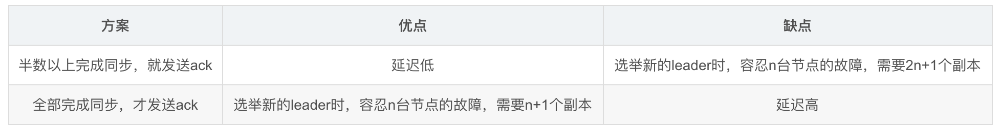

# 一. 为什么使用消息系统
## 1、解耦：
允许你独立的扩展或修改两边的处理过程，只要确保它们遵守同样的接口约束。看这么个场景。A 系统发送数据到 BCD 三个系统，通过接口调用发送，如果 E 系统也要这个数据呢？那如果 C 系统现在不需要了呢？A 系统负责人几乎崩溃。A 系统要时时刻刻考虑 BCDE 四个系统如果挂了该咋办？要不要重发，要不要把消息存起来？
## 2、异步通信： 
允许用户把一个消息放入队列，但并不立即处理它。想向队列中放入多少消息就放多少，然后在需要的时候再去处理它们。
## 3、缓冲：
有助于控制和优化数据流经过系统的速度，解决生产消息和消费消息的处理速度不一致的情况。
## 4、顺序保证:
在大多使用场景下，数据处理的顺序都很重要。大部分消息队列本来就是排序的，并且能保证数据会按照特定的顺序来处理。（Kafka保证一个Partition内的消息的有序性）
## 5、峰值处理能力: 
数据量急剧增加的时候，每次消费数据的能力不变，不会对系统造成影响。
## 6、冗余：
可以采用一对多的方式，一个生产者发布消息，可以被多个订阅topic的服务消费到，供多个毫无关联的业务使用。

  

- (1) Producer : 消息生产者，就是向kafka broker发消息的客户端；
- (2) Consumer : 消息消费者，向kafka broker取消息的客户端;
- (3) Topic : 可以理解为一个队列, 消息的分类。
- (4) Broker : 一台kafka服务器就是一个broker。一个集群由多个broker组成。一个broker可以容纳多个topic；
- (5) Partition : 为了实现扩展性，一个非常大的topic可以分布到多个broker（即服务器）上，一个topic可以分为多个partition，每个partition是一个有序的队列。partition中的每条消息都会被分配一个有序的id（offset）。kafka只保证按一个partition中的顺序将消息发给consumer，不保证一个topic的整体（多个partition间）的顺序；
- (6) Offset：kafka的存储文件都是按照offset.kafka来命名，用offset做名字的好处是方便查找。例如你想找位于2049的位置，只要找到2048.kafka的文件即可。当然the first offset就是00000000000.kafka。
- (7) Consumer Group （CG）：  
这是kafka用来实现一个topic消息的广播（发给所有的consumer）和单播（发给任意一个consumer）的手段。一个topic可以有多个CG。topic的消息会复制（不是真的复制，是概念上的）到所有的CG，但每个partion只会把消息发给该CG中的一个consumer。如果需要实现广播，只要每个consumer有一个独立的CG就可以了。要实现单播只要所有的consumer在同一个CG。用CG还可以将consumer进行自由的分组而不需要多次发送消息到不同的topic；
#
# 存储方式
- (1)kafka是使用磁盘而不是kafka服务器broker进程内存来进行数据存储，并且基于磁盘顺序读写和MMAP技术来实现高性能。
- (2) 整个分区的数据不是由一个数据文件存放的，而是由多个segments组成的，即上面看到的0000.log文件是其中一个segment文件，文件名是以该文件的第一个数据相对于该分区的全局offset命名的。每当segment文件达到一定的大小，则会创建一个新的segment文件，具体大小在server.properties配置：默认为1G。

- (3)当broker接收到producer发送过来的消息时，需要根据消息的主题和分区信息，将该消息写入到该分区当前最后的segment文件中，文件的写入方式是追加写。
由于是对segment文件追加写，故实现了对磁盘文件的顺序写，避免磁盘随机写时的磁盘寻道的开销，同时由于是追加写，故写入速度与磁盘文件大小无关.

# 2. 写入顺序
- (1) producer先从zookeeper找到该partition的leader
- (2) producer将消息发送给该leader
- (3) leader将消息写入本地log
- (4) followers从leader pull消息，写入本地log后向leader发送ACK
- (5)leader收到所有ISR中的replication的ACK后，增加HW（high watermark，最后commit 的offset）并向producer发送ACK

# 3. 页缓存PageCache
虽然消息写入是磁盘顺序写入，没有磁盘寻道的开销，但是如果针对每条消息都执行一次磁盘写入，则也会造成大量的磁盘IO，影响性能。
所以在消息写入方面，broker基于MMAP技术，即内存映射文件，将消息先写入到操作系统的页缓存中，由页缓存直接映射到磁盘文件，不需要在用户空间和内核空间直接拷贝消息，所以也可以认为消息传输是发送在内存中的。

# 4.数据存入分区的原则
(1) 指定了partition，则直接写入  
(2) 未指定partition但指定了key，根据key求hash值，处于分区个数，取余(hashcode % partions)，指定分区。   
(3) partition和key均未指定，则使用轮询指定一个partition  

# 5. 存储策略
无论消息是否被消费，kafka都会保留所有消息。有两种策略可以删除旧数据：  
1）基于时间：log.retention.hours=168  
2）基于大小：log.retention.bytes=1073741824

#
# kafka的 ISR 机制
### ISR:In-Sync Replicas 副本同步队列
### AR:Assigned Replicas 所有副本
ISR是由leader维护，follower从leader同步数据有一些延迟（包括延迟时间replica.lag.time.max.ms和延迟条数replica.lag.max.messages两个维度, 当前最新的版本0.10.x中只支持replica.lag.time.max.ms这个维度），任意一个超过阈值都会把follower剔除出ISR, 存入OSR（Outof-Sync Replicas）列表，新加入的follower也会先存放在OSR中。AR=ISR+OSR。

给每个 Partition 维护一个 ISR 列表，这个列表里一定会有 Leader，然后还会包含跟 Leader 保持同步的 Follower。也就是说，只要 Leader 的某个 Follower 一直跟他保持数据同步，那么就会存在于 ISR 列表里。但是如果 Follower 因为自身发生一些问题，导致不能及时的从 Leader 同步数据过去，那么这个 Follower 就会被认为是“out-of-sync”，被从 ISR 列表里踢出去。
## Propagate(生产)消息
通过zookeeper先知道leader在哪一台机器上，然后produce将消息发送到leader上，Follower 在收到该消息并写入其 Log 后，向 Leader 发送 ACK。一旦 Leader 收到了 ISR 中的所有 Replica 的 ACK，该消息就被认为已经 commit 了，Leader 将增加 HW 并且向 Producer 发送 ACK。

## ACK 前需要保证有多少个 Replica 已经收到该消息
Leader 会跟踪与其保持同步的 Replica 列表，该列表称为 ISR（即 in-sync Replica）。如果一个 Follower 宕机，或者落后太多，Leader 将把它从 ISR 中移除。

Kafka 的复制机制既不是完全的同步复制，也不是单纯的异步复制。完全同步复制要求所有能工作的 Follower 都复制完，这条消息才会被认为 commit，这种复制方式极大的影响了吞吐率（高吞吐率是 Kafka 非常重要的一个特性）。而异步复制方式下，Follower 异步的从 Leader 复制数据，数据只要被 Leader 写入 log 就被认为已经 commit，这种情况下如果 Follower 都复制完都落后于 Leader，而如果 Leader 突然宕机，则会丢失数据。

## Data Replication如何处理Replica全部宕机
1、等待ISR中任一Replica恢复,并选它为Leader

等待时间较长,降低可用性
或ISR中的所有Replica都无法恢复或者数据丢失,则该Partition将永不可用
2、选择第一个恢复的Replica为新的Leader,无论它是否在ISR中

并未包含所有已被之前Leader Commit过的消息,因此会造成数据丢失
可用性较高
## Data Replication如何处理Replica恢复
leader挂掉了，从它的follower中选举一个作为leader，并把挂掉的leader从ISR中移除，继续处理数据。一段时间后该leader重新启动了，它知道它之前的数据到哪里了，尝试获取它挂掉后leader处理的数据，获取完成后它就加入了ISR。

## ack机制

# kafka如何保证写入的数据不丢失

1. 每个 Partition 都至少得有 1 个 Follower 在 ISR 列表里，跟上了 Leader 的数据同步。

2. 每次写入数据的时候，都要求至少写入 Partition Leader 成功，同时还有至少一个 ISR 里的 Follower 也写入成功，才算这个写入是成功了。

如果不满足上述两个条件，那就一直写入失败，让生产系统不停的尝试重试，直到满足上述两个条件，然后才能认为写入成功。

# 如何保证Kafka消息不被重复消费
kafka实际上有个offset的概念，就是每个消息写进去，都有一个offset，代表他的序号，然后consumer消费了数据之后，每隔一段时间，会把自己消费过的消息的offset提交一下，代表我已经消费过了，下次我要是重启啥的，你就让我继续从上次消费到的offset来继续消费吧。

但是凡事总有意外，比如我们之前生产经常遇到的，就是你有时候重启系统，看你怎么重启了，如果碰到点着急的，直接kill进程了，再重启。这会导致consumer有些消息处理了，但是没来得及提交offset，尴尬了。重启之后，少数消息会再次消费一次。  
其实重复消费不可怕，可怕的是你没考虑到重复消费之后，怎么保证幂等性。  

生产者发送每条数据的时候，里面加一个全局唯一的id，类似订单id之类的东西，然后你这里消费到了之后，先根据这个id去比如redis里查一下，之前消费过吗？如果没有消费过，你就处理，然后这个id写redis。如果消费过了，那你就别处理了，保证别重复处理相同的消息即可。

# Redis与Kafka的区别
Kafka与Redis PUB/SUB之间较大的区别在于Kafka是一个完整的系统，而Redis PUB/SUB只是一个套件。  
## Redis PUB/SUB使用场景：

1. 消息持久性需求不高
2. 吞吐量要求不高
3. 可以忍受数据丢失
4. 数据量不大

Kafka使用场景：

上面以外的其他场景：）
1. 高可靠性
2. 高吞吐量
3. 持久性高
4. 多样化的消费处理模型

# 如何保证百万级写入速度：

1、页缓存技术 + 磁盘顺序写  
操作系统本身有一层缓存，叫做page cache，是在内存里的缓存，我们也可以称之为os cache，意思就是操作系统自己管理的缓存。在写入磁盘文件的时候，可以直接写入这个os cache里，也就是仅仅写入内存中，接下来由操作系统自己决定什么时候把os cache里的数据真的刷入磁盘文件中。  
2、零拷贝技术

# kafka为什么快
如何保证百万级写入速度  +  
Pull 拉模式 使用拉模式进行消息的获取消费，与消费端处理能力相符。

## kafka producer 打数据，ack  为 0， 1， -1 的时候代表啥， 设置 -1 的时候，什么情况下，leader 会认为一条消息 commit了

    - 1（默认）  数据发送到Kafka后，经过leader成功接收消息的的确认，就算是发送成功了。在这种情况下，如果leader宕机了，则会丢失数据。  
    - 0 生产者将数据发送出去就不管了，不去等待任何返回。这种情况下数据传输效率最高，但是数据可靠性确是最低的。  
    - -1 producer需要等待ISR中的所有follower都确认接收到数据后才算一次发送完成，可靠性最高。当ISR中所有Replica都向Leader发送ACK时，leader才commit，这时候producer才能认为一个请求中的消息都commit了。  

# kafka的message格式是什么样的
一个Kafka的Message由一个固定长度的header和一个变长的消息体body组成

# 为什么Kafka不支持读写分离？
在 Kafka 中，生产者写入消息、消费者读取消息的操作都是与 leader 副本进行交互的，从 而实现的是一种主写主读的生产消费模型。

Kafka 并不支持主写从读，因为主写从读有 2 个很明 显的缺点:

(1)数据一致性问题。数据从主节点转到从节点必然会有一个延时的时间窗口，这个时间 窗口会导致主从节点之间的数据不一致。某一时刻，在主节点和从节点中 A 数据的值都为 X， 之后将主节点中 A 的值修改为 Y，那么在这个变更通知到从节点之前，应用读取从节点中的 A 数据的值并不为最新的 Y，由此便产生了数据不一致的问题。

(2)延时问题。类似 Redis 这种组件，数据从写入主节点到同步至从节点中的过程需要经 历网络→主节点内存→网络→从节点内存这几个阶段，整个过程会耗费一定的时间。而在 Kafka 中，主从同步会比 Redis 更加耗时，它需要经历网络→主节点内存→主节点磁盘→网络→从节 点内存→从节点磁盘这几个阶段。对延时敏感的应用而言，主写从读的功能并不太适用。

# Kafka中是怎么体现消息顺序性的？
kafka每个partition中的消息在写入时都是有序的，消费时，每个partition只能被每一个group中的一个消费者消费，保证了消费时也是有序的。
整个topic不保证有序。如果为了保证topic整个有序，那么将partition调整为1.

# 在 Kafka 中，ZooKeeper 的作用是什么?
目前，Kafka 使用 ZooKeeper 存放集群元数据、成员管理、Controller 选举，以及其他一些管理类任务。之后，等 KIP-500 提案完成后，Kafka 将完全不再依赖 于 ZooKeeper。

记住，一定要突出“目前”，以彰显你非常了解社区的演进计划。“存放元数据”是指主题 分区的所有数据都保存在 ZooKeeper 中，且以它保存的数据为权威，其他“人”都要与它 保持对齐。“成员管理”是指 Broker 节点的注册、注销以及属性变更，等 等。“Controller 选举”是指选举集群 Controller，而其他管理类任务包括但不限于主题 删除、参数配置等。

不过，抛出 KIP-500 也可能是个双刃剑。碰到非常资深的面试官，他可能会进一步追问你 KIP-500 是做的。一言以蔽之:KIP-500 思想，是使用社区自研的基于 Raft 的共识算法， 替代 ZooKeeper，实现 Controller 自选举。